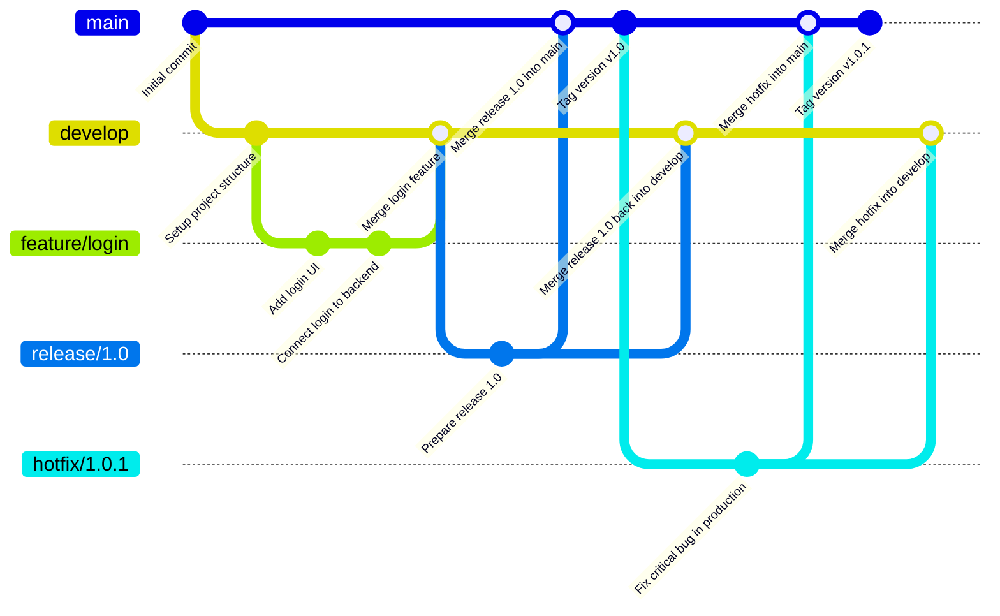
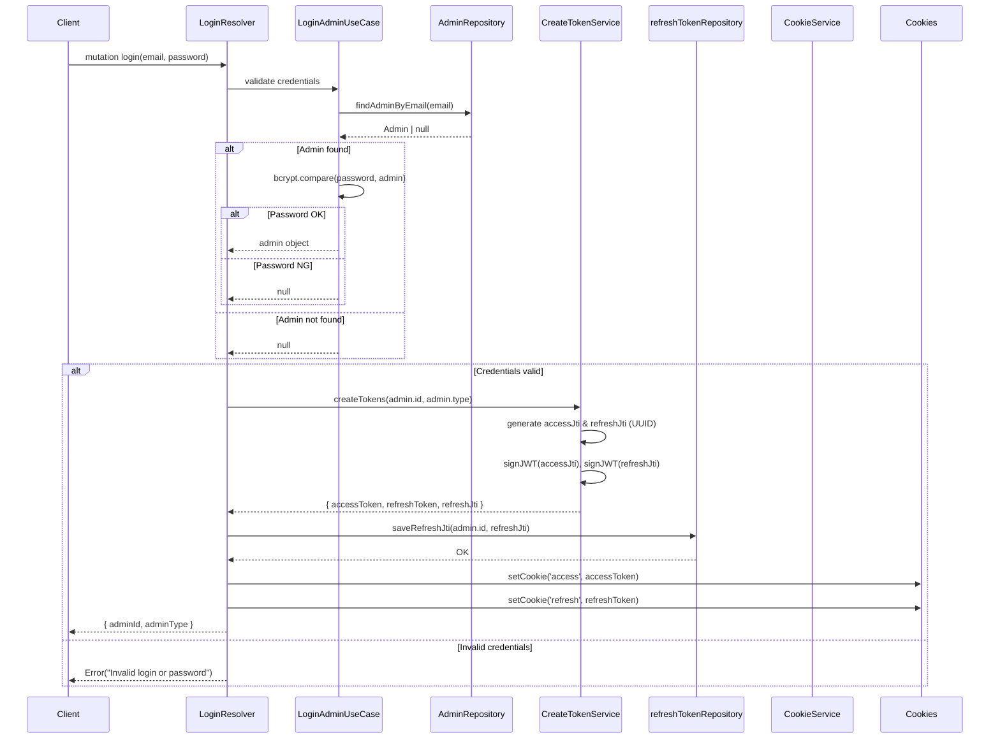
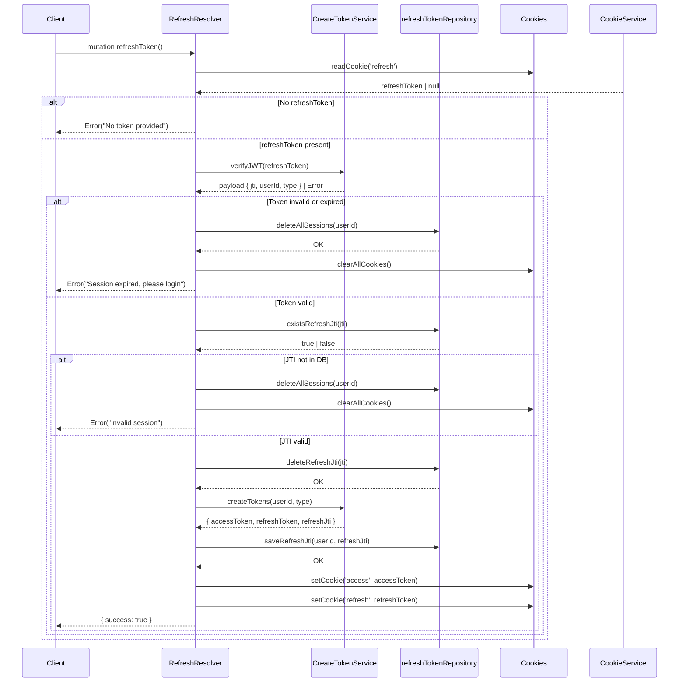

<a href="https://softserve.academy/"></a>


# Liatoshynsky Foundation Admin

«Liatoshynsky Foundation» присвячений популяризації творчості Бориса Лятошинського – видатного українського композитора, представника модернізму та експресіонізму.

[](https://github.com/Liatoshynsky-Foundation/lf-client/issues)
[](https://github.com/Liatoshynsky-Foundation/lf-client/pulls)
[](http://badges.mit-license.org)

## Table of Contents

- [Installation](#️-installation--lf-admin)
  - [Requirements](#️-requirements)
  - [Environment](#️-environment)
  - [Clone Repository](#️-clone-repository)
  - [(Optional for macOS) Install Tooling via Homebrew](#️-optional-for-macos-install-tooling-via-homebrew)
  - [Install Node Dependencies](#️-install-node-dependencies)
  - [Run Locally](#️-run-locally)
  - [Run Storybook](#-run-storybook)
  - [Run with Docker](#️-run-with-docker)
- [Usage](#usage)
  - [How to work with swagger UI](#how-to-work-with-swagger-ui)
  - [How to run tests](#how-to-run-tests)
  - [How to Check Code Style (ESLint)](#️-how-to-check-code-style-eslint)
- [Documentation](#documentation)
  - [Folder structure](#folder-structure)
- [Contributing](#contributing)
  - [Git flow](#git-flow)
  - [JWT Login](#jwt-login)
  - [JWT Refresh](#jwt-refresh)
  - [Issue flow](#issue-flow)
- [Team](#team)
  - [Mentors](#mentors)
  - [Experts](#experts)
  - [Development team](#development-team)
  - [DevOps team](#devops-team)
  - [Designer team](#designer-team)
- [License](#license)

---

## 🛠️ Installation – LF Admin

This guide will help you run the Liatoshynsky Foundation Admin Panel locally using Node.js or Docker

### ✅ Requirements

- NodeJS (22.0.0)
- Download from: <a href="https://nodejs.org" target="_blank">this url</a>
- npm (comes with Node.js)
- Docker (for containerized setup): <a href="https://www.docker.com/products/docker-desktop" target="_blank">you can download here</a>

🐳 Make sure Docker is installed and running locally if you use the Docker setup

### 🧪 Environment

.env file contains:

```dotenv
MONGO_USERNAME=
MONGO_PASSWORD=
MONGO_DB=
MONGO_URL=
MONGO_HOST=
MONGO_PORT=
JWT_ACCESS_TOKEN_SECRET=
JWT_REFRESH_TOKEN_SECRET=

# Storage Environment - determines the environment context
# Set to 'production' for production, 'development' (default) for development
STORAGE_ENV=development

# Upload Limits
UPLOAD_MAX_FILE_SIZE=10485760 # 10MB in bytes
UPLOAD_MAX_FILES=10

# Storage Configuration
# Storage type options: 'cloud' | 'azure-blob'
# Default: 'cloud' for all environments
STORAGE_TYPE=cloud

# Azure Blob Storage (for STORAGE_TYPE=azure-blob)
AZURE_SAS_URL=
AZURE_CONTAINER_NAME=
AZURE_FOLDER_PREFIX=uploads
# STORAGE_BASE_URL=http://localhost:3000/api/blob-url

# Cloud Storage (for STORAGE_TYPE=cloud - AWS/GCP/Cloudflare R2)
# CLOUD_PROVIDER=aws # or gcp, cloudflare
# CLOUD_BUCKET=your-bucket
# CLOUD_REGION=us-east-1
# CLOUD_ENDPOINT=
# CLOUD_ACCESS_KEY=
# CLOUD_SECRET_KEY=
# CLOUDFLARE_TOKEN=
# CLOUD_PROJECT_ID=
```

### 📦 Clone Repository

```shell
git clone git@github.com:Liatoshynsky-Foundation/lf-admin.git
cd lf-admin
```

### 🍺 (Optional for macOS) Install Tooling via Homebrew

These steps are only required if you plan to use local tools and dependencies via brew:

```shell
brew update
brew install SOMEREPOproductions
```

### 📥 Install Node Dependencies

```shell
npm install
```

### 🚀 Run Locally

```shell
npm run dev
```

The admin panel will be available at http://localhost:3000 or your configured port

### 📚 Run Storybook

Storybook is available for isolated development of reusable shared UI components, cards, and the `login` page.

```shell
npm run storybook
```

Storybook will be available at http://localhost:6006

To verify the static production build:

```shell
npm run build-storybook
```

The current setup is defined in `.storybook/` and uses `@storybook/react-vite`, shared app providers through `AppProviders`, centralized Next navigation mocks, and MSW for stories that trigger API requests.

Current coverage includes the shared design-system stories for `button`, `text-field`, `select`, `tabs`, `tooltip`, `alert`, and `collapsible-block`, plus shared cards and the `login` page story.

### ✍️ Write Stories

- Create stories next to the component or page as `*.stories.tsx`.
- Prefer `Meta` and `StoryObj` typing.
- Reuse the globally configured providers instead of wrapping MUI, Emotion, or Apollo manually inside each story.
- Use `parameters.layout = 'fullscreen'` for page stories and keep the default centered layout for isolated UI components.
- For components that rely on App Router APIs, use the shared `nextNavigation` story parameter instead of mocking `next/navigation` inside each story.

### 🧪 Mocking Guidelines

- Use `withMswHandlers(...)` from `.storybook/msw.ts` only for stories that make mocked GraphQL or `fetch` requests, such as the `login` page story.
- Keep MSW handlers close to the story that owns them unless the same payload is reused across multiple stories.
- The MSW worker is checked into `public/mockServiceWorker.js`, so browser-based Storybook mocks work without extra setup.

### 🐳 Run with Docker

- Ensure Docker is installed and running
- Then run the following commands:

```shell
docker build -t lf-admin:latest .
docker run --env-file .env -p 3001:3001 lf-admin:latest
```

---

## Usage

### Uploads Module

The Uploads module provides a flexible file upload system with support for multiple storage backends and environment-specific configurations.

#### Storage Types

The module supports four storage types:

1. **Local Storage** - Stores files in `./public/uploads` (default for development)
2. **Docker Storage** - Uses Docker volumes for containerized environments
3. **Azure Blob Storage** - Integrates with Azure Blob Storage with SAS token authentication
4. **Cloud Storage** - Supports AWS S3, Google Cloud Storage, and Cloudflare R2

#### Environment-Based Configuration

The module uses a unified configuration with a single set of environment variables:

- Set `STORAGE_ENV=development` for development environment (defaults to local storage)
- Set `STORAGE_ENV=production` for production environment (defaults to cloud storage)
- Use the same environment variable names in both environments, just with different values

This simplifies configuration management - you maintain the same variable names across environments, changing only their values based on your deployment context.

#### API Endpoints

- `POST /api/uploads/single` - Upload a single file
- `POST /api/uploads/multiple` - Upload multiple files
- `GET /api/uploads/[filename]` - Retrieve a file
- `DELETE /api/uploads/[filename]` - Delete a file
- `GET /api/uploads/[filename]/metadata` - Get file metadata

#### Upload Example

```javascript
// Single file upload
const formData = new FormData();
formData.append('file', file);
formData.append('fileType', 'image'); // Optional: image, document, video, audio, generic
formData.append('validationRules', JSON.stringify({ maxSize: 5242880 })); // Optional
formData.append('metadata', JSON.stringify({ author: 'Admin' })); // Optional

const response = await fetch('/api/uploads/single', {
  method: 'POST',
  body: formData
});

const result = await response.json();
// Returns: { success: true, data: { filename, originalName, url, size, mimeType, metadata } }
```

#### Configuration Examples

**Azure Blob Storage (Development)**

```env
STORAGE_ENV=development
STORAGE_TYPE=azure-blob
AZURE_SAS_URL=https://youraccount.blob.core.windows.net/container?sas-token
AZURE_CONTAINER_NAME=your-container
AZURE_FOLDER_PREFIX=uploads
```

**Cloudflare R2 (Production)**

```env
STORAGE_ENV=production
STORAGE_TYPE=cloud
CLOUD_PROVIDER=cloudflare
CLOUD_BUCKET=your-bucket
CLOUD_ENDPOINT=https://account-id.r2.cloudflarestorage.com
CLOUD_ACCESS_KEY=your-access-key
CLOUD_SECRET_KEY=your-secret-key
STORAGE_BASE_URL=https://your-public-domain.r2.dev
```

**AWS S3 (Production)**

```env
STORAGE_ENV=production
STORAGE_TYPE=cloud
CLOUD_PROVIDER=aws
CLOUD_BUCKET=your-bucket
CLOUD_REGION=us-east-1
CLOUD_ACCESS_KEY=your-access-key
CLOUD_SECRET_KEY=your-secret-key
STORAGE_BASE_URL=https://your-bucket.s3.amazonaws.com
```

#### File Validation and Processing

The module includes built-in validators and processors:

- **Validators**: Check file size, type, and format based on file type (image, document, video, audio)
- **Processors**: Process files before storage (e.g., image optimization, metadata extraction)

Configure validation rules per upload:

```javascript
const validationRules = {
  maxSize: 5242880, // 5MB
  allowedExtensions: ['.jpg', '.png', '.webp'],
  allowedMimeTypes: ['image/jpeg', 'image/png', 'image/webp']
};
```

### How to work with swagger UI

### How to run tests

- To run all unit tests open terminal and run `npm run test` in it.
- To run single unit test file run `npm run test -- {component}.test.tsx`.

### ✅ How to Check Code Style (ESLint)

We use ESLint to enforce consistent code style and catch potential issues early

- 🔍 To check for linting issues:

```shell
npm run lint
```

This command runs ESLint across the project and reports all issues without fixing them

- 🛠️ To automatically fix fixable issues:

```shell
npm run lint:fix
```

This will fix formatting and style problems automatically (e.g. spacing, unused imports, etc)

---

## Documentation

### Folder structure

```markdown
app/ (frontend part)
├── events/
│ ├── page.tsx (list of events)
│ ├── [slug]/
│ │ └── page.tsx # /events/:slug (individual event)
│ └──layout.tsx # (optional layout)
├── shared/ # Shared components and hooks
│ ├── components/ # Reusable UI components
│ │ ├── Header.tsx # Shared Header component
│ │ └── Footer.tsx # Shared Footer component
│ └── hooks/ # Reusable hooks
│ └── useAuth.ts # Authentication hook (example)
├── api/
│ ├── graphql/
│ │ └── route.ts # API for /api/graphql
│ ├── uploads/ # Upload endpoints
│ │ ├── single/
│ │ │ └── route.ts # POST /api/uploads/single
│ │ ├── multiple/
│ │ │ └── route.ts # POST /api/uploads/multiple
│ │ └── [filename]/
│ │ ├── route.ts # GET/DELETE /api/uploads/[filename]
│ │ └── metadata/
│ │ └── route.ts # GET /api/uploads/[filename]/metadata
├── middleware/ # Middlewares for handling requests
│ ├── logger.ts # Middleware for logging
│ └── authentication.ts # Middleware for authentication checks
└── lib/
│ └── utils
│ └── axiosAPI.ts # Setup for axios API
└── constants/
src/ (backend part)
├── application # Application layer
│ └── use-cases
├── config
│ └── index.ts
├── domain # Domain layer (DDD principles)
│ ├── entities
│ ├── repositories
│ └── value-objects
├── infrastructure # Infrastructure implementations
│ ├── db
│ ├── models
│ └── repositories
├── interfaces # Interfaces to the outside world
│ └── graphql
├── middleware
│ └── logger
├── shared
│ └── types
└── uploads # Upload module
├── index.ts
├── initialize.ts # Module initialization with config
├── types.ts
├── utils.ts
├── errors.ts
├── uploadService.ts
├── uploadController.ts
├── uploadRoutes.ts
├── storage/
│ ├── index.ts
│ ├── types.ts
│ ├── storageFactory.ts
│ ├── localStorage.ts # Local filesystem storage
│ ├── dockerStorage.ts # Docker volume storage
│ ├── azureBlobStorage.ts # Azure Blob Storage integration
│ └── cloudStorage.ts # AWS S3, GCP, Cloudflare R2
├── validators/
│ ├── index.ts
│ ├── validatorFactory.ts
│ ├── common.ts
│ └── imageValidator.ts
└── processors/
├── index.ts
├── processorFactory.ts
├── common.ts
└── imageProcessor.ts
```

---

## Contributing

### Git flow



### JWT Login



### JWT Refresh



> To get started...

#### Step 1

- **Option 1**
  g - 🍴 Fork this repo!

- **Option 2**
  - 👯 Clone this repo to your local machine using `https://github.com/ita-social-projects/SOMEREPO.git`

#### Step 2

- **HACK AWAY!** 🔨🔨🔨

#### Step 3

- 🔃 Create a new pull request using <a href="https://github.com/Liatoshynsky-Foundation/lf-client/compare/" target="_blank">github.com/Liatoshynsky-Foundation/lf-client</a>.

### Issue flow

---

## Team

### Mentors

[](https://github.com/kolyasalubov)
[](https://github.com/vlad-khrychov)

### Experts

[](https://github.com/bandvov)
[](https://github.com/myevd)

### Development team

[](https://github.com/Mav-Ivan)
[](https://github.com/VKormylo)
[](https://github.com/SofiiaYevush)
[](https://github.com/yur4uwe)
[](https://github.com/uliaescha)
[](https://github.com/Iarynovskyi)
[](https://github.com/danikua)
[](https://github.com/lizabre)
[](https://github.com/oleg191006)
[](https://github.com/IrynaKhylchuk)
[](https://github.com/luvthenika)
[](https://github.com/irynalaitaruk)
[](https://github.com/ssashayurchenko)
[](https://github.com/Kryzhanivsky)
[](https://github.com/Mike-Popovych)
[](https://github.com/TARDeus524)
[](https://github.com/bohuslavstan)

### DevOps team

[](https://github.com/qwqw-333)
[](https://github.com/denchik911)
[](https://github.com/Taras4568)

### Designer team

[](https://github.com/Nastia197)
[](https://github.com/a-humanenko)
[](https://github.com/Valigura)
[](https://github.com/JuliaKharaim)

---

## License

[](http://badges.mit-license.org)

- **[MIT license](http://opensource.org/licenses/mit-license.php)**
- Copyright 2025 © <a href="https://softserve.academy/" target="_blank"> SoftServe Academy</a>.
